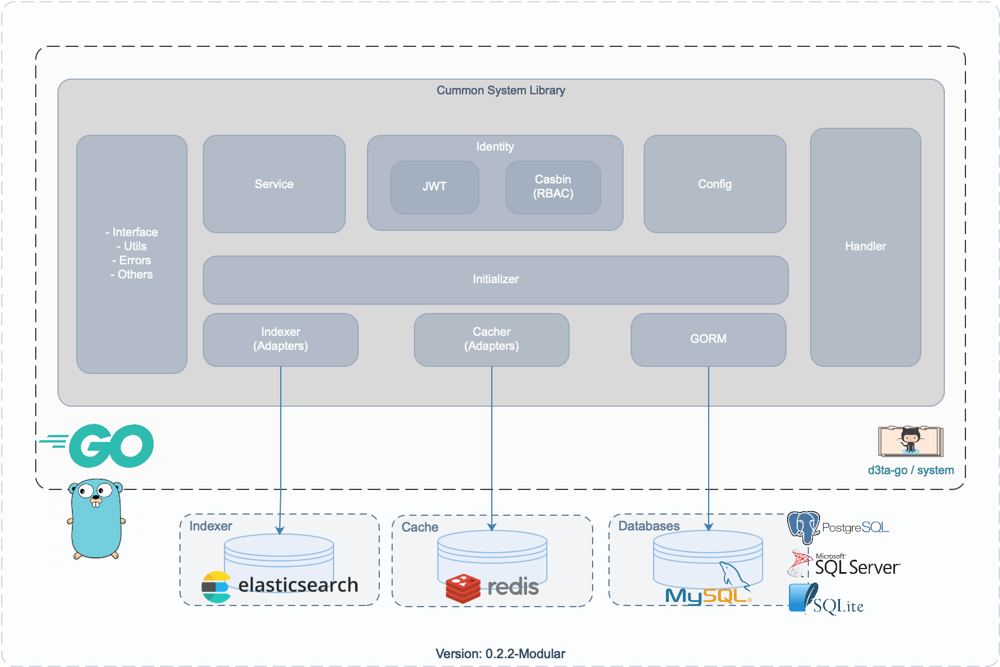

# system

System Module/Package (Common System Libararies)

As a part of `Simple Implementation of Modular DDD Technical Architecture Patterns in Go`.

## Diagram v 0.2.2-Modular



## Components

**A. System**

1. Config
2. Identity & Access Management (JWT, Casbin - RBAC)
3. Initilizer
4. Adapters (Indexer, Cacher, GORM)
5. Handler
6. Service (SMTP, Casbin Enforcer, etc)
7. Utils
8. Error
9. etc

**B. Interface**

1. Common middleware, response, feature for Echo (labstack) Framework.

## Related Libraries/Infrastructure:

**1. Database (GORM)**

- MySQL
- PostgreSQL
- MS SQL Server
- SQLite

**2. Indexer**

- Elastic Search

**3. Cache**

- GOCamaron Cache (Redis, Memcache, MySQL, PostgreSQL, memory, file, ledis, nodb)
- Redis

**4. Identity & Access Management**

- Identity: JWT & Custom Claims
- Client Device Identity
- RBAC (Role Based Access Control) - Casbin

### Development

**1. Clone**

```shell
$ git clone https://github.com/d3ta-go/system.git
```

**2. Setup**

```
a. copy `conf/config-sample.yaml` to `conf/config.yaml`
b. copy `conf/data/test-data-sample.yaml` to `conf/data/test-data.yaml`
c. setup your dependencies/requirements (e.g: database, smtp, etc.)
```

**3. Runing TDD on Development Stage**

> Go to specific package and then run `go test [options]`
